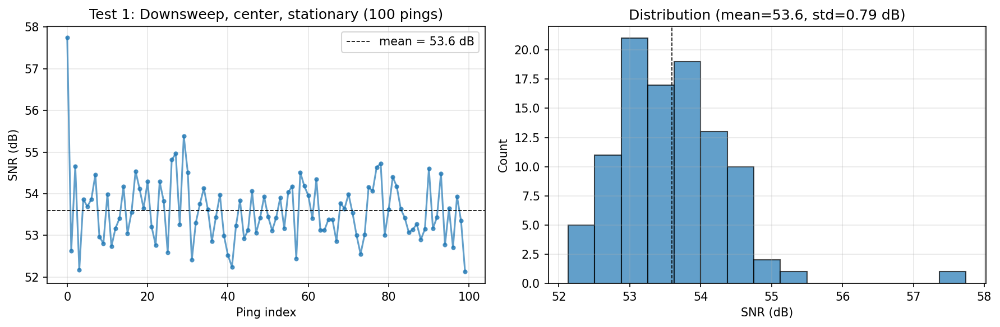
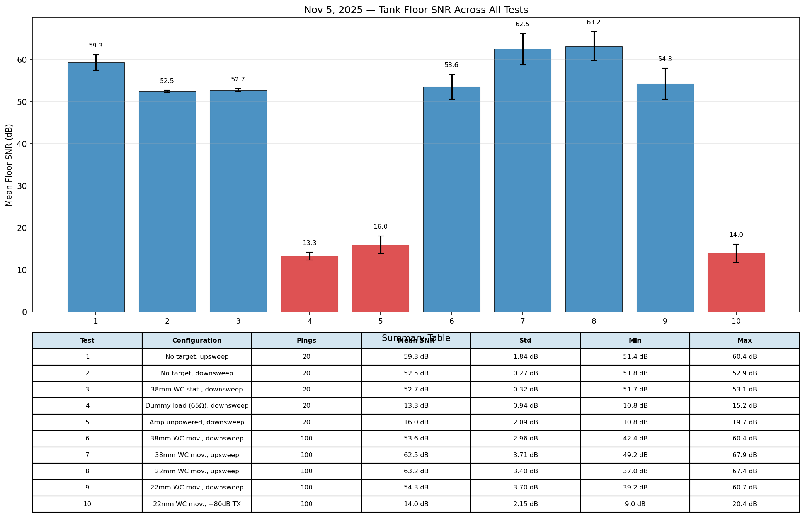
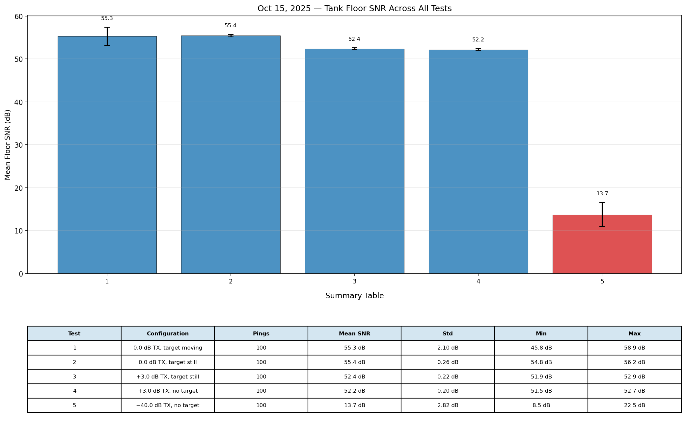
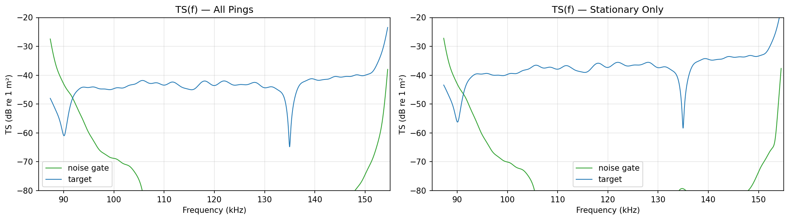
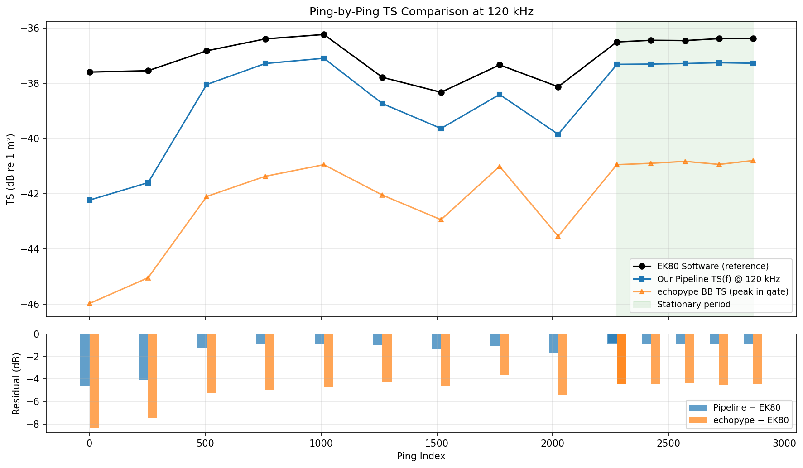
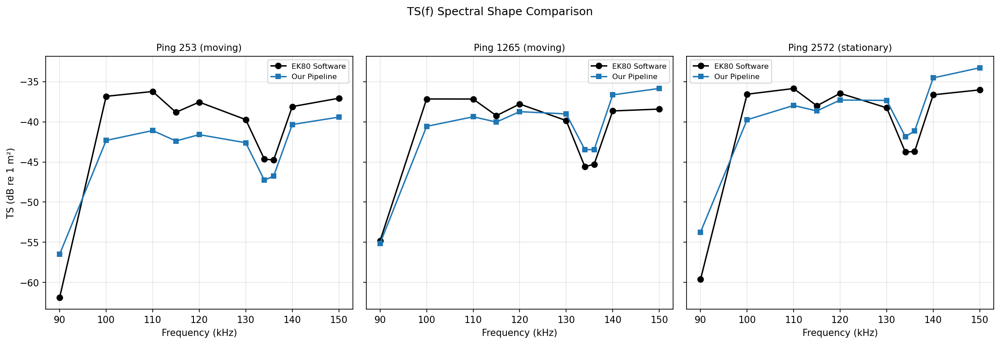
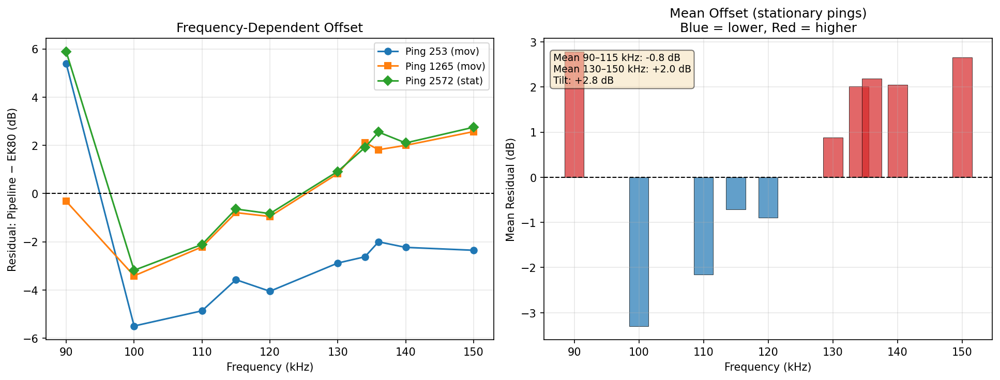
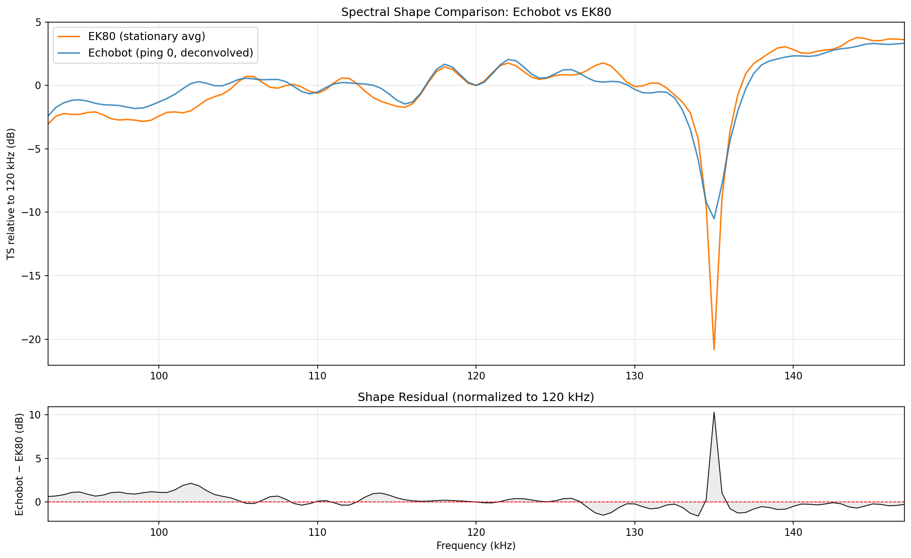
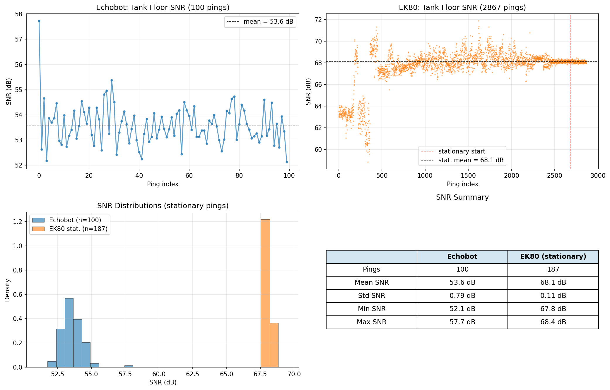

# Status Update on EchoBot Data Analysis

**Date:** 02/25/2026
**Author:** Emmett Culane

---

## 1. System Characterization

### 1a. Noise Floor

To get a sense of the system's baseline noise, we ran the echobot with very low transmit power or with the transducer replaced by a resistor, so that there is no real acoustic signal going out. The matched filter still produces some output from electronic noise alone. The table below collects these "noise-only" measurements across two separate test sessions.

| Test | Configuration | Mean SNR (dB) |
|---|---|---|
| Oct 15, Test 5 | -40 dB transmit power, no target | 13.7 |
| Nov 5, Test 4 | Transducer replaced with 65 ohm dummy load | 13.3 |
| Nov 5, Test 10 | -80 dB transmit power, 22 mm sphere in water | 14.0 |
| Nov 5, Test 5 | Power amplifier unpowered | 16.0 |

The noise floor seems to sit around 13-14 dB across different sessions and different ways of suppressing the acoustic signal. The "amp unpowered" case reads slightly higher (16 dB), possibly because a different noise source dominates when the amplifier is off.

*Source: Results Analysis, finding 4 in [`notebooks/echobot_SNR_eval/101525_CRL_tests_SNR.ipynb`](notebooks/echobot_SNR_eval/101525_CRL_tests_SNR.ipynb).*

---

### 1b. SNR / Dynamic Range

**SNR definition.** For each ping, we compute a signal-to-noise ratio in the voltage domain:

> SNR (dB) = 20 * log10( V_peak / V_mean )

where V_peak is the peak of the matched filter envelope in a "signal" range gate (the tank floor, 2.5-5.0 m), and V_mean is the mean envelope level in a nearby "quiet" region (2.0-2.5 m) where we expect mostly noise. This is computed after bandpass filtering and matched filtering (cross-correlation with the transmitted chirp).

More detail on the processing steps is given in the echobot pipeline notebook and readme at [`notebooks/echobot_process/`](notebooks/echobot_process/).

**Example: Sept 4 Test 1 (downsweep, center, stationary)**

| Parameter | Value |
|---|---|
| File | `backcyl_bis_rgh0.01271_T143330_100.mat` |
| Time | 14:33:30 local |
| TX Power | +3.0 dB |
| Targets | 38.1 mm WC + 22 mm BB |
| Chirp | Downsweep |
| Position | Center, stationary |
| Pings | 100 |

This test produces a per-ping SNR time series and histogram. Typical values are around 53 dB with very low spread (standard deviation below 0.5 dB).

*Source: [`notebooks/echobot_SNR_eval/090425_CRL_tests_SNR.ipynb`](notebooks/echobot_SNR_eval/090425_CRL_tests_SNR.ipynb), Test 1.*

**Nov 5 summary (10 tests).** The Nov 5 session included tests with different targets (38 mm and 22 mm tungsten carbide spheres), chirp directions (upsweep and downsweep), a dummy resistor load, unpowered amplifier, and reduced transmit power. The summary bar chart and table cover all 10 tests.

*Source: Summary section of [`notebooks/echobot_SNR_eval/110525_CRL_tests_SNR.ipynb`](notebooks/echobot_SNR_eval/110525_CRL_tests_SNR.ipynb).*

**Oct 15 summary (5 tests).** The Oct 15 session used a 22 mm ball bearing target at 115 cm range, with transmit power levels of 0.0, +3.0, and -40.0 dB, and the target either stationary or moving.

*Source: Summary section of [`notebooks/echobot_SNR_eval/101525_CRL_tests_SNR.ipynb`](notebooks/echobot_SNR_eval/101525_CRL_tests_SNR.ipynb).*

**Cross-session comparison.** Looking across all three test dates (Sept 4, Oct 15, Nov 5), we can compare how downsweep and upsweep perform under different conditions.

*Downsweep:*

| Session | Configuration | Mean SNR |
|---|---|---|
| Sept 4 | +3.0 dB, center (Tests 1-4) | 53.4 dB |
| Sept 4 | +3.0 dB, all quadrants (Tests 5-16) | 52.5-53.4 dB |
| Nov 5 | +3.0 dB, no target (Test 2) | 52.5 dB |
| Nov 5 | +3.0 dB, 38 mm moving (Test 6) | 53.6 dB |
| Nov 5 | +3.0 dB, 22 mm moving (Test 9) | 54.3 dB |

*Upsweep:*

| Session | Configuration | Mean SNR |
|---|---|---|
| Sept 4 | +3.0 dB, center (Tests 17-18) | 54.3 dB |
| Sept 4 | +3.0 dB, quadrants (Tests 19-22) | 53.8-54.3 dB |
| Oct 15 | +3.0 dB, no target (Test 4) | 52.2 dB |
| Oct 15 | 0.0 dB, 22 mm stationary (Test 2) | 55.4 dB |
| Nov 5 | +3.0 dB, no target (Test 1) | 59.3 dB |
| Nov 5 | +3.0 dB, 38 mm moving (Test 7) | 62.5 dB |
| Nov 5 | +3.0 dB, 22 mm moving (Test 8) | 63.2 dB |

Downsweep values are fairly stable across sessions, sitting around 52-54 dB. Upsweep values are more spread out, ranging from about 52 dB up to 63 dB depending on the session.

*Source: Cross-Session Comparison in Discussion section of [`notebooks/echobot_SNR_eval/090425_CRL_tests_SNR.ipynb`](notebooks/echobot_SNR_eval/090425_CRL_tests_SNR.ipynb).*

---

### 1d. Questions and Operational Considerations

**Upsweep vs. downsweep.** Downsweep gives consistent results from session to session (~53 dB, with less than 2 dB spread across all three test dates). Upsweep can give higher SNR in some sessions (up to ~63 dB on Nov 5) but the values vary a lot between sessions. The reason for this upsweep variability is not yet clear.

**Moving targets and SNR variability.** In the Oct 15 and Nov 5 tests, moving targets showed somewhat higher ping-to-ping SNR variability compared to stationary targets. However, in the Sept 4 "quadrant" tests (where the targets were also moving), the variability stayed very low. One possible explanation: in the Sept 4 session, the transducer and targets were positioned near the center of the tank, while in the later sessions they may have been placed closer to the tank walls. Reflections from nearby walls could introduce more variability when targets are in motion.

**Practical recommendation.** Downsweep seems like the safer choice for measurements that need to be comparable across different sessions, since its SNR is more predictable. If upsweep is used, it would probably be worth checking its SNR against a downsweep baseline at the start of each session.

---

## 2. EK80 Calibration in Python (via echopype)

### 2a. Obtaining TS(f)

We processed an EK80 `.raw` file (90-150 kHz FM chirp recording of a 38 mm tungsten carbide calibration sphere) using the `echopype` Python library. The library handles reading the raw file, applying the receiver filter coefficients, and performing pulse compression. From the pulse-compressed output, we computed frequency-dependent target strength TS(f) by taking a short range gate around the target, windowing, and computing the power spectrum. The figure shows TS(f) for all pings and for stationary-target pings only.

*Source: Section 11 of [`notebooks/EK80_process/EK80_pipeline_01.ipynb`](notebooks/EK80_process/EK80_pipeline_01.ipynb). More detail on the EK80 processing parameters and steps is given in the readme and pipeline notebook at [`notebooks/EK80_process/`](notebooks/EK80_process/).*

### 2b. Obtaining SNR

The EK80 SNR is computed using the same equation described in Section 1b above:

> SNR (dB) = 20 * log10( V_peak / V_mean )

with the same gate definitions (signal: 2.5-5.0 m, noise: 2.0-2.5 m), but applied to the EK80 pulse-compressed envelope instead of the echobot matched filter envelope. The intent is to put both systems on the same footing for comparison.

*See Section 7 of [`notebooks/system_comparison/echobot_vs_ek80_comparison.ipynb`](notebooks/system_comparison/echobot_vs_ek80_comparison.ipynb) for the side-by-side implementation.*

### 2c. Manual Validation via EK80 Software Output

To check that our Python processing gives reasonable numbers, we compared our pipeline's output against values read manually from the Simrad EK80 desktop software for the same recording.

**Ping-by-ping TS at 120 kHz.** We sampled about 15 pings spread across the recording (some while the sphere was moving, some stationary) and compared our TS values at 120 kHz against the EK80 software. The top panel shows the three TS time series (our pipeline, echopype broadband TS, and EK80 software reference). The bottom panel shows the residuals.

*Source: Section 1 of [`notebooks/EK80_process/EK80_validation_analysis.ipynb`](notebooks/EK80_process/EK80_validation_analysis.ipynb).*

**TS(f) spectral comparison.** For three selected pings, we compared the full frequency spectrum of TS against EK80 software values at 10 key frequencies (90-150 kHz). The spectral shapes track fairly closely.

*Source: Section 2 of [`notebooks/EK80_process/EK80_validation_analysis.ipynb`](notebooks/EK80_process/EK80_validation_analysis.ipynb).*

**Spectral residuals.** The left panel shows the per-ping residual (our pipeline minus EK80 software) as a function of frequency. The right panel shows the mean residual across the two cleanest pings. There appears to be a slight frequency-dependent tilt in the residuals, with our values reading a bit lower at the low end and a bit higher at the high end. This could be related to a time-varying gain correction G(t) that may not be fully accounted for in our processing but is applied internally by the EK80 software.

*Source: Section 3 of [`notebooks/EK80_process/EK80_validation_analysis.ipynb`](notebooks/EK80_process/EK80_validation_analysis.ipynb).*

---

## 3. Preliminary Comparison: EchoBot vs. EK80

### 3a. TS(f)

Both systems recorded the same 38 mm tungsten carbide sphere in the same tank on the same day (Sept 4, 2025). To compare spectral shapes, both TS(f) curves are normalized to their value at 120 kHz, removing the absolute calibration difference. The overlay shows the frequency-dependent interference pattern from the sphere. The two systems track each other fairly well across the 93-147 kHz band, with residuals mostly within a few dB.

*Source: Section 3 of [`notebooks/system_comparison/echobot_vs_ek80_comparison.ipynb`](notebooks/system_comparison/echobot_vs_ek80_comparison.ipynb).*

### 3b. SNR

Using the same SNR definition and gate ranges (Section 1b / 2b), we computed per-ping tank floor SNR for both systems. The figure shows time series and histograms for both, along with a summary table. Both systems produce similar SNR levels for the tank floor signal. The comparison uses post-matched-filter / post-pulse-compression envelopes so that both systems have comparable processing gain.

*Source: Section 7 of [`notebooks/system_comparison/echobot_vs_ek80_comparison.ipynb`](notebooks/system_comparison/echobot_vs_ek80_comparison.ipynb).*
